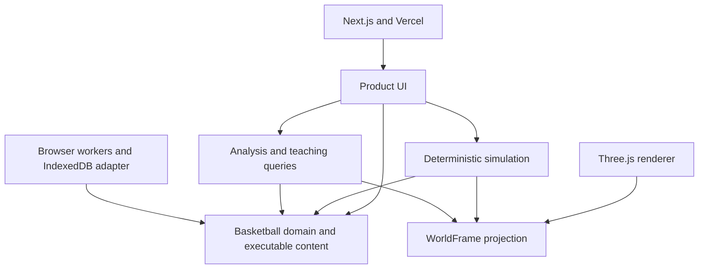

# CourtIQ foundation

CourtIQ is one product: **Lab** figures basketball out, **Our System** remembers how the program plays, **Teach** gives that basketball to players, and **Library** brings executable problems into the Lab.

The application installs, builds, boots, executes basketball and saves program knowledge without an account, database, AI service or backend credentials. The former player-training product has been removed. Git history preserves it; there is no parallel legacy application.

## Dependency direction

| Boundary          | Owner                                       | Responsibility                                                                                   |
| ----------------- | ------------------------------------------- | ------------------------------------------------------------------------------------------------ |
| Domain            | `packages/basketball/src/domain`            | Basketball values, serializable execution representation, graph references and bounded semantics |
| Content           | `packages/basketball/src/content`           | Authored situations, family compilers, terminology and search recipes                            |
| Simulation        | `packages/basketball/src/simulation`        | Fixed-step motion, observed policies, possession, physical flights and execution history         |
| Queries           | `packages/basketball/src/queries`           | Option windows, arrival, responsibility conflicts, comparison and policy-derived authoring       |
| Program knowledge | `packages/basketball/src/program`           | Versioned accepted answers, teaching metadata, migrations and portable envelopes                 |
| Product           | `apps/web/components/courtiq`               | Coach interaction, transient Lab drafts and views                                                |
| Rendering         | `apps/web/components/courtiq/world`         | Camera, athletes, marks, quality and interpolation of domain frames                              |
| Persistence       | `apps/web/lib/persistence`                  | Native asynchronous IndexedDB transactions and browser lifecycle                                 |
| Browser execution | `apps/web/lib/basketball`                   | Workers, cancellation and a bounded immutable UI replay cache                                    |
| Infrastructure    | Next.js configuration, CI and `vercel.json` | Build and serve the product                                                                      |

The pure basketball package imports no React, Three.js, Next.js, browser storage, database SDK, hosting SDK, AI SDK or application file. Its production typecheck excludes the DOM. The boundary checker rejects outward imports and browser globals. Product and infrastructure depend on basketball; basketball never depends on them.

## Executable basketball

`ExecutionInput` is the authoritative serializable basketball experiment. It contains an explicit content identity, engine/schema versions, authored role and opportunity identifiers, players and matchups, initial ball/read state, bounded actions, ordered policy rules, observations, targets, read graph, parameters, assumptions, personnel and interventions.

The expression algebra expresses the observations and geometry already required by the two fixtures. It has finite depth and collection budgets, finite numeric bounds and validated references. Aggregate obligations, replicated text, projected replay output and analytical pair work are bounded before current execution can be imported or replayed; runtime guards enforce the same limits. It is deliberately smaller than an arbitrary scripting language. Rule identifiers are opaque. Equal-priority rules use authored order rather than lexical identifier order; once/latch, exclusion, replacement and release behavior are explicit.

High P&R's `LabConfig` and `TeamAnswer` are its coaching/authoring interface. Its compiler translates Drop, Switch, Blitz, Hedge and ICE, counters, conditional coaching sentences and offensive preferences into the shared execution representation. These names belong to that content family. The simulation kernel does not dispatch on coverage names, counter names, family names or literal rule IDs. An unknown editing recipe is never silently interpreted as High P&R. A validated frozen input can replay independently of the installed catalog when its engine and execution schema are compatible.

The hero remains **High P&R → low-man help → weakside lift / skip**. A separate baseline-drive fixture uses driver, drifter, dunker and rotation roles and finish/dump/drift/skip opportunities. It exercises the same execution, analysis, comparison and serialization paths without a screen or P&R role aliases. It is a generality test, not another product surface.

Git-authored content is validated and materialized into a deterministic manifest consumed by runtime. There is no database seed. Adding a supported basketball problem means authoring content against the shared primitives; adding a genuinely new mechanism requires a deliberate schema/engine change and cross-family tests.

## Simulation and evidence

The engine uses deterministic fixed steps. The runtime owns ball-flight state, read memory, observed policy activations, rule/action lifecycle, RNG and delayed observation history. `WorldFrame` is a presentation projection, not a complete resumable checkpoint. Camera, renderer quality, athlete clips, visual speed and interpolation cannot choose actions or change model truth.

A portable bookmark/fork consists of the exact immutable execution input and a tick. It reproduces history by replaying from the beginning; interventions apply from their authored tick onward. Arbitrary checkpoint restoration is outside this foundation. Prefix invariance, independent branches and deterministic replay are required tests.

Policy evaluations carry the observation and effective ticks, memory, parameters, source rules and resulting obligations. The tag rail projects that recorded evaluation instead of inventing a new policy from the displayed frame. Arrival X-Ray consumes capability-aware domain samples; the shader colors a field rather than reimplementing movement equations. Compare ghosts use the assumptions of the experiment they depict.

Analysis reports modeled windows, arrival estimates, conflicts, actual launch/catch/contact witnesses and uncertainty. It predicts no shooting percentage or wins. An intersection is evidence of contact geometry, not an inferred turnover or foul. Break My Defense performs a bounded authored search; it cannot certify a defense against unsearched basketball.

## Program knowledge and local persistence

One `ProgramKnowledge` aggregate owns program preferences and accepted answers. A Lab draft is transient. Acceptance creates stable entry and immutable version identities, parent/base lineage, exact executable input and content/engine/query identities, scope, terminology, teaching metadata and relevant evidence. Editing or retesting produces another accepted version rather than mutating history. Teach pins the accepted version and replays its stored input.

The browser repository commits a program revision in one IndexedDB transaction and resolves success only after transaction completion. Revision compare-and-swap rejects stale cross-tab writes. There is no second canonical localStorage store or automatic downgrade on storage failure. An uncommitted candidate remains exportable, with an honest failure status.

Migration checks both former local collections, imports each committed raw source once through a ledger, and retains the originals. Rejected sources remain available for recovery. Corrupt or future-schema records are preserved for recovery and block unsafe writes. Legacy answers with missing execution provenance are marked unverified and require a deliberate retest; they are never stamped with today's engine version or silently replayed as verified.

Export/import uses one bounded, versioned JSON envelope. Validation checks size, counts, finite values and graph references. Import merges atomically: identical identity/payload is idempotent; divergent identities are handled explicitly or copied with their reference graph remapped. Affected incoming descendants are copied even when their own payload was originally identical, preserving their intended ancestry. Timestamp-based last-write-wins is not program history. Unsupported execution versions remain readable/exportable and cannot silently execute through the installed engine. Native Lab editing requires an available recipe whose recompilation equals the accepted input exactly. Descriptive scope labels do not pretend to resolve lineup/game identities; ambiguous answers remain ambiguous.

The durable program and portable backup share a **128 MiB compact JSON budget**, with at most 300 entries and 500 versions per entry. History is never silently truncated. Representative byte measurements predict about 268 versions carrying one frozen Break each, or 678 ordinary versions across entries; the single-entry version limit may bind earlier. These are finite storage allowances, not a certification of browser quota or maximum-size performance. A future repository/wire adapter can page history and deduplicate frozen content without changing basketball execution or accepted identities. The same export/import bound ensures a produced backup can be restored by this codec.

Future cloud synchronization can implement the repository adapter around these portable values, stable IDs and explicit lineage. No cloud backend, account model or synchronization service is implemented now. Offense, film and AI can author or annotate validated basketball values later; they cannot become canonical truth or alter the domain dependency direction.

## Deployment and retirement

The pipeline is `INSTALL → VALIDATE / MATERIALIZE LOCAL CONTENT → BUILD → DEPLOY`. CI uses Node 22, pinned pnpm 9, a frozen lockfile, content and boundary checks, typecheck, lint, tests and a production build. Fonts and executable content are local. Vercel runs a plain product build; there are no database mutations, production seeds or crons.

Removed: Daily, Pathways, training, Academy, leaderboard, login/auth, old profile/account routes, associated APIs/services/reward/mastery engine, Prisma schemas/migrations/seeds, Supabase integration, retired content and duplicate scenario/DefenseLab shells. Useful athlete, gym, body, motion and asset primitives were extracted into the current renderer or pure simulation. Licenses and editable Blender sources remain with the assets.

See [migration decisions](docs/architecture/MIGRATION.md), [verification evidence](docs/architecture/VERIFICATION.md), [basketball sources](docs/basketball/policy-sources.md) and [rendering performance protocol](docs/rendering/performance-protocol.md).

## Limits

This is a bounded half-court possession model with authored physical assumptions and finite rule/read lifecycles, not a calibrated prediction system or arbitrary full-game simulator. Local knowledge belongs to one browser origin until exported. Real coach acceptance and GPU performance on physical school laptops still need direct validation; software GL verifies functionality, not hardware frame rate.
